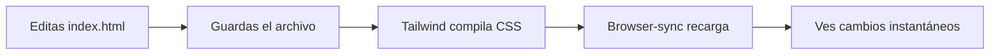

# 🎨 Playground Tailwind CSS + Agentes IA

> **Proyecto educativo** para aprender HTML y Tailwind CSS utilizando agentes de inteligencia artificial en VS Code.

[](https://tailwindcss.com)
[](https://github.com/features/copilot)
[](LICENSE)

---

## 📖 ¿Qué es este proyecto?

Este es un **playground (área de juegos/experimentación)** diseñado específicamente para estudiantes que quieren aprender diseño web moderno utilizando:

- ✨ **HTML5 Semántico** - Estructura web correcta y profesional
- 🎨 **Tailwind CSS** - Framework de utilidades CSS moderno
- 🤖 **GitHub Copilot Agent Mode** - Asistente IA que te ayuda a crear componentes

### 🎯 Objetivo Principal

Permitir que los estudiantes **experimenten, creen y visualicen** componentes y páginas web de forma interactiva, con la ayuda de un agente IA que entiende las mejores prácticas de desarrollo web.

---

## 🚀 Inicio Rápido

### Prerequisitos

Asegúrate de tener instalado:

- [Node.js](https://nodejs.org/) (v16 o superior)
- [VS Code](https://code.visualstudio.com/)
- [GitHub Copilot](https://github.com/features/copilot) (suscripción activa)

### Instalación

1. **Haz fork del repositorio** o clónalo:

```bash
git clone https://github.com/sil7en/playground-tailwindcss-agents.git
cd playground-tailwindcss-agents
```

2. **Instala las dependencias**:

```bash
npm install
```

3. **Inicia el servidor de desarrollo**:

```bash
npm run dev
```

4. **¡Listo!** El navegador se abrirá automáticamente en `http://localhost:3000`

---

## 📁 Estructura del Proyecto

```
playground-tailwindcss-agents/
│
├── .github/
│   └── instructions/
│       └── project-context.instructions.md  # Instrucciones para el agente IA
│
├── assets/
│   ├── css/
│   │   ├── base.css       # Input de Tailwind (importa directivas)
│   │   └── styles.css     # Output compilado (generado automáticamente)
│   ├── images/            # Tus imágenes aquí
│   └── js/
│       └── scripts.js     # JavaScript vanilla opcional
│
├── solved/                # 📂 Soluciones de ejercicios
│   ├── ejercicio-responsive-solucion.html
│   ├── ejercicio-flex-solucion.html
│   └── ejercicio-grid-solucion.html
│
├── index.html             # 🏠 Página principal con navegación
├── responsive.html        # 📱 Guía de Diseño Responsive
├── flex.html              # ↔️ Guía de Flexbox CSS
├── grid.html              # ⊞ Guía de Grid CSS
├── api.html               # 🌐 Guía de APIs REST
├── ejercicio-responsive.html  # ✏️ Ejercicio de Responsive
├── ejercicio-flex.html    # ✏️ Ejercicio de Flexbox
├── ejercicio-grid.html    # ✏️ Ejercicio de Grid
├── ejercicio-api.html     # ✏️ Ejercicio de APIs
├── custom.html            # 🎨 Página en blanco para creación libre
├── package.json           # Dependencias y scripts
├── tailwind.config.js     # Configuración de Tailwind
└── README.md              # Este archivo
```

### 📄 Archivos Clave

| Archivo | Propósito | ¿Puedo modificarlo? |
|---------|-----------|---------------------|
| `index.html` | Página principal con navegación a tutoriales | ✅ **SÍ - Landing page** |
| `custom.html` | Página en blanco para creación libre | ✅ **SÍ - ¡Crea aquí!** |
| `responsive.html` | Tutorial interactivo de diseño responsive | ✅ Sí |
| `flex.html` | Tutorial interactivo de Flexbox | ✅ Sí |
| `grid.html` | Tutorial interactivo de CSS Grid | ✅ Sí |
| `components.html` | Tutorial interactivo de Web Components | ✅ Sí |
| `api.html` | Tutorial interactivo de APIs REST | ✅ Sí |
| `ejercicio-*.html` | Ejercicios prácticos para estudiantes | ✅ **SÍ - Completa aquí** |
| `solved/*.html` | Soluciones de los ejercicios | 📖 Solo lectura |
| `assets/js/scripts.js` | JavaScript vanilla para interactividad | ✅ Sí |
| `assets/css/base.css` | Input de Tailwind (directivas @tailwind) | ⚠️ Solo si sabes qué haces |
| `assets/css/styles.css` | CSS compilado por Tailwind | ❌ **NO - Auto-generado** |
| `tailwind.config.js` | Configuración de Tailwind | ⚠️ Solo para personalización avanzada |
| `package.json` | Dependencias del proyecto | ❌ NO |

---

## 🛠️ Cómo Funciona

### 1️⃣ **Flujo de Desarrollo**



### 2️⃣ **Scripts Disponibles**

| Comando | Descripción |
|---------|-------------|
| `npm run dev` | Inicia servidor de desarrollo con hot-reload |
| `npm run watch:css` | Solo compila Tailwind en modo watch |
| `npm run build:css` | Compila y minifica CSS para producción |

### 3️⃣ **Hot Reload Automático**

El script `npm run dev` ejecuta dos procesos en paralelo:

1. **Tailwind CSS en modo watch**: Detecta cambios en archivos HTML/JS y recompila el CSS
2. **BrowserSync**: Servidor local que recarga el navegador automáticamente

**Resultado**: Guardas → Ves los cambios al instante ⚡

---

## 🤖 Trabajando con el Agente IA

### Configuración del Agente

Este proyecto incluye instrucciones específicas para GitHub Copilot en:
```
.github/instructions/project-context.instructions.md
```

El agente está configurado para:
- ✅ Usar **solo** clases de Tailwind CSS
- ✅ Crear HTML semántico y accesible
- ✅ Diseñar responsive (mobile-first)
- ✅ Seguir mejores prácticas de performance
- ❌ **NO** usar CSS personalizado ni frameworks adicionales
- ❌ **NO** modificar archivos de configuración sin permiso

### 💡 Ejemplos de Prompts Efectivos

#### ✅ Buenos Prompts

```
"Crea un hero section con fondo degradado de azul a morado, 
título grande centrado, subtítulo y un botón CTA"

"Añade una grid responsive de cards de productos, 
cada una con imagen, título, precio y botón de comprar. 
1 columna en móvil, 2 en tablet, 3 en desktop"

"Haz una navbar sticky con logo a la izquierda, 
menú horizontal en desktop y hamburger menu en móvil"

"Crea una sección de testimonios con 3 cards que incluyan 
foto, nombre, cargo y reseña de 5 estrellas"
```

#### ❌ Prompts Poco Efectivos

```
"Hazme una página bonita"           # Muy vago
"Añade Bootstrap"                     # Viola las reglas
"Usa estilos inline"                  # No permitido
"Instala jQuery"                      # No se usan librerías
```

### 🎨 Componentes para Practicar

Pide al agente que te ayude a crear:

- 🏠 **Hero Sections** - Secciones principales impactantes
- 📦 **Product Cards** - Tarjetas de productos/servicios
- 🧭 **Navigation Bars** - Barras de navegación responsive
- 📝 **Contact Forms** - Formularios de contacto
- 🖼️ **Image Galleries** - Galerías de imágenes
- 📊 **Feature Sections** - Secciones de características
- 💬 **Testimonials** - Testimonios de clientes
- 👣 **Footers** - Pies de página informativos
- 🎯 **Call-to-Actions** - Botones y secciones CTA
- 📱 **Mobile Menus** - Menús hamburguesa

---

## 🎓 Guía de Aprendizaje

### Nivel 1: Principiante

1. **Modifica el título y agrega párrafos**
2. **Cambia colores** usando clases de Tailwind (`bg-blue-500`, `text-gray-800`)
3. **Añade espaciado** con `p-4`, `m-8`, `space-y-4`
4. **Crea un botón** con `bg-blue-500 hover:bg-blue-700 text-white px-4 py-2 rounded`

### Nivel 2: Intermedio

1. **Crea una card** con imagen, título y descripción
2. **Haz un grid responsive** (1 columna → 2 → 3)
3. **Añade efectos hover** y transiciones
4. **Crea un formulario** con inputs y botón de envío
5. **Consume APIs públicas** con fetch() y muestra datos dinámicamente

### Nivel 3: Avanzado

1. **Hero section completo** con fondo degradado y overlay
2. **Navbar responsive** con menú hamburguesa funcional
3. **Galería de imágenes** con modal (lightbox simple)
4. **Landing page completa** con múltiples secciones
5. **Aplicación SPA** consumiendo múltiples APIs con manejo de estados

---

## 📚 Recursos de Aprendizaje

### Tailwind CSS

- 📖 [Documentación Oficial](https://tailwindcss.com/docs)
- 🎮 [Tailwind Play](https://play.tailwindcss.com) - Experimenta online
- 📝 [Cheatsheet](https://nerdcave.com/tailwind-cheat-sheet)
- 🎨 [Tailwind UI Components](https://tailwindui.com/components) - Ejemplos premium

### HTML & CSS

- 🌐 [MDN Web Docs](https://developer.mozilla.org/)
- 📖 [HTML Semántico](https://developer.mozilla.org/es/docs/Glossary/Semantics)
- ♿ [Accesibilidad Web (A11y)](https://www.w3.org/WAI/fundamentals/accessibility-intro/)

### GitHub Copilot

- 🤖 [Documentación de Copilot](https://docs.github.com/en/copilot)
- 💡 [Tips para mejores prompts](https://github.blog/2023-06-20-how-to-write-better-prompts-for-github-copilot/)

---

## ⚙️ Personalización Avanzada

### Agregar Fuentes Personalizadas

1. **Instala el paquete @fontsource**:
```bash
npm install @fontsource-variable/inter
```

2. **Importa en `assets/css/base.css`**:
```css
@import '@fontsource-variable/inter';
```

3. **Configura en `tailwind.config.js`**:
```javascript
module.exports = {
  theme: {
    extend: {
      fontFamily: {
        sans: ['Inter Variable', 'sans-serif'],
      },
    },
  },
}
```

### Agregar Colores Personalizados

Edita `tailwind.config.js`:
```javascript
module.exports = {
  theme: {
    extend: {
      colors: {
        primary: '#3B82F6',
        secondary: '#8B5CF6',
        accent: '#EC4899',
      },
    },
  },
}
```

Usa: `bg-primary`, `text-secondary`, `border-accent`

### Agregar Plugins de Tailwind

```bash
npm install @tailwindcss/forms @tailwindcss/typography
```

En `tailwind.config.js`:
```javascript
plugins: [
  require('@tailwindcss/forms'),
  require('@tailwindcss/typography'),
],
```

---

## 🐛 Solución de Problemas

### El servidor no inicia

```bash
# Limpia node_modules y reinstala
rm -rf node_modules package-lock.json
npm install
npm run dev
```

### Los cambios no se reflejan

1. Asegúrate de que `npm run dev` esté corriendo
2. Verifica que estés editando `index.html` (no `styles.css`)
3. Refresca manualmente el navegador (F5)
4. Verifica la consola del terminal por errores

### Tailwind no compila las clases

1. Verifica que tus archivos estén en las rutas del `content` en `tailwind.config.js`:
```javascript
content: [
  "./*.html",
  "./assets/js/**/*.js"
],
```

2. Usa clases completas de Tailwind (no dinámicas):
```html
✅ <div class="bg-blue-500">
❌ <div class="bg-blue-{{ color }}">
```

---

## 🤝 Contribuir

Este es un proyecto educativo open-source. Las contribuciones son bienvenidas:

1. Haz fork del proyecto
2. Crea una rama para tu feature (`git checkout -b feature/AmazingFeature`)
3. Commit tus cambios (`git commit -m 'Add some AmazingFeature'`)
4. Push a la rama (`git push origin feature/AmazingFeature`)
5. Abre un Pull Request

---

## 📝 Reglas del Proyecto

### ✅ Permitido

- Modificar `index.html` completamente
- Usar todas las clases de Tailwind CSS
- Agregar JavaScript vanilla en `scripts.js`
- Experimentar con diseños y componentes
- Personalizar colores y fuentes (avanzado)

### ❌ No Permitido

- Usar CSS personalizado (estilos inline o archivos CSS custom)
- Agregar frameworks CSS adicionales (Bootstrap, Bulma, etc.)
- Usar librerías JavaScript sin permiso (jQuery, React, etc.)
- Modificar archivos compilados (`styles.css`)

---

## 📄 Licencia

Este proyecto está bajo la licencia ISC. Ver archivo [LICENSE](LICENSE) para más detalles.

---

## 👨‍🏫 Sobre el Proyecto

**Creado para**: Estudiantes que aprenden desarrollo web  
**Propósito**: Experimentación práctica con Tailwind CSS  
**Herramientas**: HTML5, Tailwind CSS, GitHub Copilot  
**Nivel**: Principiante a Intermedio  

---

## � Módulo de APIs REST

### `api.html` - Aprende a Consumir APIs

Módulo completo e interactivo sobre cómo trabajar con APIs públicas:

#### 📋 Contenido del Tutorial

- ✅ **¿Qué son las APIs REST?** - Conceptos fundamentales explicados con analogías
- ✅ **Anatomía de una Request** - URL, métodos HTTP, headers, body
- ✅ **Demo 1: PokeAPI** - Busca información de Pokémon en tiempo real
- ✅ **Demo 2: Weather API** - Consulta el clima de cualquier ciudad
- ✅ **Estados HTTP** - Tabla completa con códigos 200, 404, 500, etc.
- ✅ **Manejo de Errores** - Buenas prácticas con try/catch
- ✅ **Casos de Uso Reales** - Ejemplos de apps del mundo real
- ✅ **Mejores Prácticas** - Do's y Don'ts al trabajar con APIs

#### 🎯 Ejercicios Prácticos

El archivo `ejercicio-api.html` incluye **3 desafíos** con APIs reales:

1. **Rick & Morty API** 👽
   - Busca personajes de la serie
   - API: `https://rickandmortyapi.com/api/character`
   - Muestra: nombre, especie, estado, imagen, origen

2. **Random User Generator** 👤
   - Genera usuarios aleatorios
   - API: `https://randomuser.me/api/`
   - Muestra: foto, nombre, email, país, edad

3. **Giphy API** 🎬
   - Busca GIFs animados
   - API: `https://api.giphy.com/v1/gifs/search`
   - Muestra: grilla responsive con 6 GIFs

#### 🔑 APIs Gratuitas Incluidas

Todas las APIs usadas son **públicas y gratuitas** (sin necesidad de registro):

- 🎮 **PokeAPI** - Datos de todos los Pokémon
- 🌤️ **Open-Meteo** - Clima en tiempo real
- 👽 **Rick & Morty API** - Personajes de la serie
- 👤 **Random User API** - Usuarios ficticios
- 🎬 **Giphy** - Millones de GIFs (API key incluida para aprendizaje)

#### 💡 Conceptos que Aprenderás

- `fetch()` con **async/await**
- Manejo de **promesas**
- Parsear respuestas **JSON**
- Validación de datos
- Estados de **loading**
- Manejo de **errores** con try/catch
- Template literals para **HTML dinámico**
- Acceso a **datos anidados**

#### 🚀 Solución Completa

El archivo `solved/ejercicio-api-solucion.html` incluye:
- ✅ Implementación completa de los 3 desafíos
- ✅ Código comentado y explicado
- ✅ Manejo profesional de errores
- ✅ UI/UX responsive con Tailwind CSS
- ✅ Explicaciones de puntos clave en cada desafío

---

## �🎨 Creación Libre

### `custom.html` - Tu Lienzo en Blanco

Este archivo está especialmente diseñado para que los estudiantes puedan **crear libremente** sin restricciones:

- 🎯 **Body completamente vacío** - Empieza desde cero
- 📝 **Comentarios guía** - Tips y sugerencias dentro del archivo
- 💡 **Ideas de proyectos** - Inspiración para empezar
- 🚀 **Desafíos sugeridos** - Desde fácil hasta difícil

**Acceso directo**: Abre `custom.html` y empieza a crear tu proyecto único.

```bash
# Abre directamente en el navegador
open custom.html
# O con el servidor de desarrollo activo, visita:
http://localhost:3000/custom.html
```

---

## 💬 Soporte

¿Tienes preguntas? 

- 📧 Abre un [Issue](../../issues)
- 💬 Consulta las [Discussions](../../discussions)
- 🤖 Pregúntale al agente IA en VS Code

---

<div align="center">

**⭐ Si este proyecto te ayudó, dale una estrella ⭐**

Hecho con ❤️ para estudiantes que quieren aprender desarrollo web

</div>
